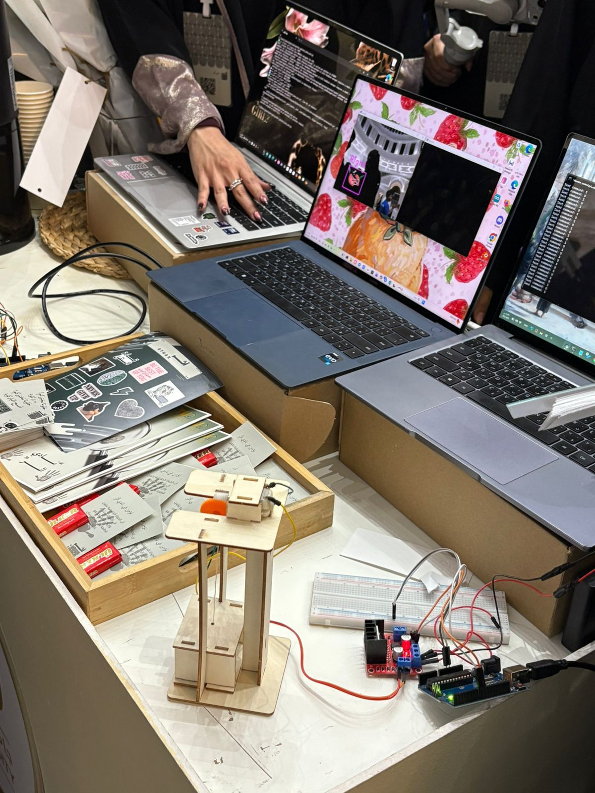

#  AI Gesture-Controlled Elevator

> **"Lift with a pinch. No touch required."**
> *A contactless smart elevator prototype controlled by hand gestures using Computer Vision.*

[](https://www.python.org/)
[](https://www.arduino.cc/)
[](https://opencv.org/)
[](https://google.github.io/mediapipe/)

---

##  Project Overview
The **AI Smart Elevator** is an engineering project that integrates **Computer Vision** with **Embedded Systems** to create a hygienic, contactless control mechanism.

Instead of pressing physical buttons, the system tracks the user's hand landmarks in real-time. The **Euclidean distance** between the *Thumb* and *Index finger* is calculated and mapped to a precise angle for a **Servo Motor**, which physically drives the elevator cabin up and down.

###  Key Features:
* **Contactless Control:** Promotes hygiene in public spaces by eliminating physical touch.
* **Precision Tracking:** Uses **MediaPipe** to track 21 hand landmarks with millimeter accuracy.
* **Real-Time Response:** Instantaneous communication between Python (Processing) and Arduino (Actuation).
* **Accessibility:** Offers an intuitive interface for users with limited mobility.

---

##  System Demo
*By pinching fingers, the distance is translated into the elevator's vertical height.*


![Elevator Demo]

https://github.com/user-attachments/assets/6990c6cb-d630-434e-a61f-bf2e8a0b7719




---

##  How It Works (Mechanism)
1.  **Detection:** The Webcam captures the hand frame. **MediaPipe** extracts coordinates for the Thumb Tip (Point 4) and Index Tip (Point 8).
2.  **Calculation:** Python calculates the Euclidean Distance between the two fingertips.
3.  **Mapping:** The pixel distance (e.g., 30px - 250px) is mapped to the Servo Motor's angle (0° - 180°).
4.  **Actuation:** The angle is sent via **Serial Communication** to the Arduino, which drives the servo to lift or lower the pulley system.

---

##  Hardware Wiring

| Component | Arduino Pin |
| :--- | :---: |
| **Servo Signal (PWM)** | Pin 9 |
| **Servo VCC** | 5V |
| **Servo GND** | GND |

*Note: For heavy loads, use an external power supply for the Servo.*

---

##  Tech Stack
* **Software:** Python 3.11, Arduino IDE
* **Libraries:** `OpenCV`, `MediaPipe`, `PySerial`
* **Hardware:** Arduino Uno, Servo Motor (SG90/MG995), Webcam, Pulley System.

---

##  Installation & Usage

1.  **Upload Firmware:** Flash the `elevator_control.ino` to your Arduino.
2.  **Install Dependencies:**
    ```bash
    pip install opencv-python mediapipe pyserial
    ```
3.  **Check Connection:** Update the `SERIAL_PORT` variable in the Python script to match your Arduino (e.g., `COM9` or `/dev/ttyUSB0`).
4.  **Run:**
    ```bash
    python main.py
    ```

---

##  Development Credits
<p align="left">
  <strong>Developed by:</strong> Eng. Alyaa<br>
</p>

---
<p align="center">
  © 2026 AlyaaBah. All Rights Reserved.
</p>
